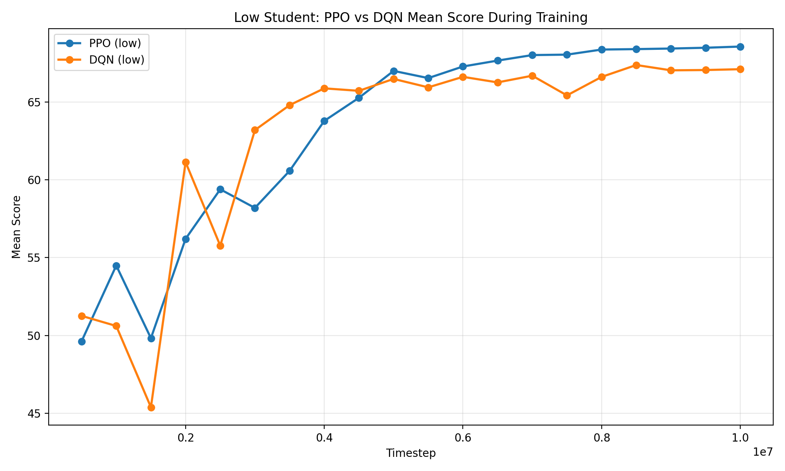
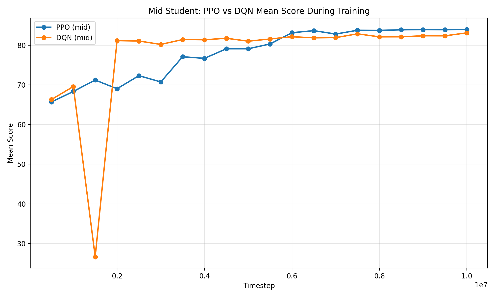
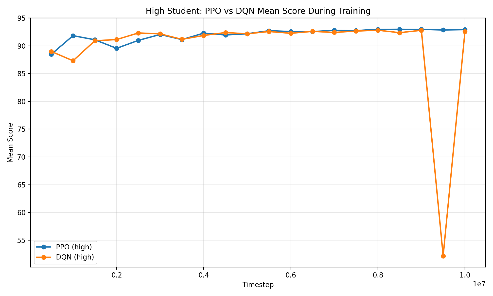

# Optimal Time Allocation in Time-Limited Tests via Reinforcement Learning

<p align="center">
  <p align="center">
    <a>Jinwoong Jung</a>&emsp;
    <a>Yuji Lim</a>&emsp;
    <a>Sangyun Lee</a>&emsp;
    <a>Jungwoo Choi</a>
  </p>
  <p align="center">
    <i>Sungkyunkwan University</i><br>
  </p>
   <p align="center">
    <i>2026 Introduction to Reinforcement Learning(AAI2024_01) Final Project</i><br>
  </p>
</p>

.png>)

## ✨ Project Overview

This project studies how to allocate time across problems in a time-limited exam using reinforcement learning.
Instead of generating answers directly, the agent learns a policy that decides:

- whether to spend more time on the current problem,
- when to move to another problem,
- how to maximize expected total score under a fixed time budget.

The current RL algorithms used in this repository are:

- `PPO` ([Proximal Policy Optimization Algorithms](https://arxiv.org/pdf/1707.06347))
- `DQN` ([Playing Atari with Deep Reinforcement Learning](https://arxiv.org/pdf/1312.5602))

The environment models confidence growth over time for each problem and converts it into expected score.

## 🛠️ Installation

### Clone

```bash
git clone https://github.com/JinWoong-Jung/Reinforcement_Learning_Final_Project_26-1.git
cd RLProject
```

### Conda

```bash
conda create -n rlproject python=3.11 -y
conda activate rlproject
pip install -r requirements.txt
```

### Main Dependencies

- Python 3.11
- `stable-baselines3`
- `gymnasium`
- `numpy`
- `torch`
- `matplotlib`

## 🧭 Problem Formulation

We model test-taking as a sequential decision-making problem.

- State: remaining exam time, current problem index, per-problem progress, time spent, difficulty level, score, problem type, confidence representation
- Action: `solve_more` or `next`
- Objective: maximize expected total score before time runs out

The confidence score for each problem is modeled as

$$
p_i(t)=c_i+(1-c_i)\space\sigma\left(\theta-\beta d_i-\gamma a_i+\alpha \log\left(1+\frac{t}{\tau}\right)\right)
$$

where the current default settings are:

| Symbol | Meaning | Current default / definition |
| --- | --- | --- |
| $\theta$ | student ability | loaded directly from student profile |
| $d_i$ | difficulty of problem $i$ | `difficulty` field in the dataset |
| $a_i$ | ambiguity of problem $i$ | entropy of `choice_rate` |
| $c_i$ | minimum probability floor | `0.2` for objective, `0.0` for subjective |
| $\alpha$ | time gain coefficient | `1.6` |
| $\beta$ | difficulty penalty coefficient | `2.9` |
| $\gamma$ | ambiguity penalty coefficient | `1.7` |
| $\tau$ | time scale | `200.0` |

The most basic reward is defined as the change in expected utility:

$$
r_t = U(s_{t+1}) - U(s_t)
$$

where the expected utility is defined as

$$
U(s)=\sum_i \text{score}_i \cdot \text{confidence}_i(s)
$$

We then add a small number of shaping terms, and the final reward used for RL becomes:

$$
\begin{aligned}
r_t = \space & \Delta U \\
&+ \mathbb{1}[\text{next}] \cdot (-0.002) \\
&+ \mathbb{1}[\text{no-work revisit}] \cdot (-0.02) \\
&+ \mathbb{1}[\text{terminal}] \cdot \left(0.5 \cdot \text{coverage fraction}\right)
\end{aligned}
$$

<sub>The reward setting can be changed through the `reward` block in the config files.</sub>

Student ability is injected directly through `theta`:

| Student level | Theta |
| --- | ---: |
| low | `1.0` |
| mid | `2.0` |
| high | `3.0` |

That is, the current implementation does not derive ability from multiple skill weights; instead, each student profile provides `theta` directly, and that value is used in the confidence equation above.

## 📝 Project Structure

```text
.
├── agents/        # PPO, DQN training logic and heuristic baselines
├── analysis/      # evaluation, comparison, trajectory inspection
├── configs/       # experiment configs for PPO and DQN
├── data/          # exam datasets and student profiles
├── env/           # exam environment, dynamics, reward, state
├── results/       # saved evaluation outputs
├── runs/          # trained model checkpoints and logs
├── tests/         # unit tests
└── utils/         # config loading, seed setup, compatibility helpers
```

Key entrypoints:

- `main.py`: train, eval, heuristic modes
- `agents/train_rl.py`: PPO and DQN training
- `analysis/trajectory_report.py`: trajectory inspection

## 🗂️ Data

The main exam data in this repository is based on the Korean CSAT mathematics exam administered on `2025.11.13`.

The dataset construction was prepared with reference to materials provided by [MegaStudy](https://www.megastudy.net/Entinfo/correctRate/main.asp?SubMainType=I&mOne=ipsi&mTwo=588)

Exam JSON fields: `exam_id`, `subject`, `total_time_sec`, `problems`

Problem-level fields: `pid`, `actual_answer`, `difficulty_level`, `difficulty`, `score`, `correct_rate`, `error_rate`, `problem_type`, `choice_rate`

Student JSON fields: `student_id`, `theta`

Examples:

- `data/25_math_calculus.json`
- `data/25_math_geometry.json`
- `data/25_math_prob_stat.json`

## 🏋️ How to Run

Use the placeholders below:

- `<algo>`: `ppo` or `dqn`
- `<level>`: `low`, `mid`, or `high`
- `<subject>`: `calculus`, `geometry`, or `prob_stat`
- `<exam_json>`: `data/25_math_calculus.json`, `data/25_math_geometry.json`, or `data/25_math_prob_stat.json`
- `<RUN_NAME>`: generated run directory name such as `ppo_20260419_171103`

### Train

```bash
python main.py --mode train --config configs/<algo>/train_<level>.yaml --output runs/<algo>/train_<level>
```

### Evaluate

```bash
python main.py --mode eval \
  --config runs/<algo>/train_<level>/<RUN_NAME>/config_snapshot.yaml \
  --model-path runs/<algo>/train_<level>/<RUN_NAME>/checkpoints/<algo>_final.zip \
  --algorithm <algo> \
  --exam-data <exam_json> \
  --episodes 100 \
  --output results/<algo>/<level>/<subject>
```

### Generate a Trajectory Report

```bash
python analysis/trajectory_report.py \
  --run-dir runs/<algo>/train_<level>/<RUN_NAME> \
  --model-path runs/<algo>/train_<level>/<RUN_NAME>/checkpoints/<algo>_final.zip \
  --algorithm <algo> \
  --exam-data <exam_json> \
  --episodes 10 \
  --max-logged-steps 80 \
  --output results/<algo>/<level>/<subject>_trajectory.json
```

### Evaluate Heuristic Baselines

```bash
python main.py --mode heuristic --config configs/ppo/train_mid.yaml --output results/heuristic
```

### Training Curve Snapshots

#### Low Student



#### Mid Student



#### High Student



## 📋 Results

### 0. Analytic Baseline

| Ability ($\theta$) | prob_stat | calculus | geometry |
| --- | ---: | ---: | ---: |
| low ($\theta=1.0$) | 56.93 | 69.62 | 66.89 |
| mid ($\theta=2.0$) | 74.71 | 84.69 | 82.80 |
| high ($\theta=3.0$) | 87.53 | 93.30 | 92.31 |

### 1. PPO

#### 1.1. Mixed-Episode Evaluation

| Level | Mean Score | Mean Reward | Mean Solved Count | Mean Coverage | Mean Steps |
| --- | ---: | ---: | ---: | ---: | ---: |
| low | 69.4006 | 49.3995 | 28.44 | 1.0000 | 234.92 |
| mid | 84.6270 | 64.6188 | 30.00 | 1.0000 | 237.40 |
| high | 93.2855 | 73.2825 | 30.00 | 1.0000 | 237.78 |

#### 1.2. Per-Subject Evaluation

| Level | Subject | Mean Score | Mean Reward | Mean Solved Count | Mean Coverage | Mean Steps | Mean Score Change Rate |
| --- | --- | ---: | ---: | ---: | ---: | ---: | ---: |
| low | calculus | 73.7830 | 53.7810 | 29.00 | 1.0000 | 235.00 | +5.98% |
| low | geometry | 71.2105 | 51.2125 | 30.00 | 1.0000 | 234.00 | +6.46% |
| low | prob_stat | 63.3035 | 43.2995 | 26.00 | 1.0000 | 236.00 | +11.20% |
| mid | calculus | 87.4956 | 67.4896 | 30.00 | 1.0000 | 237.00 | +3.31% |
| mid | geometry | 86.0339 | 66.0239 | 30.00 | 1.0000 | 238.00 | +3.91% |
| mid | prob_stat | 80.3585 | 60.3505 | 30.00 | 1.0000 | 237.00 | +7.56% |
| high | calculus | 94.7075 | 74.6855 | 30.00 | 1.0000 | 237.00 | +1.51% |
| high | geometry | 94.0222 | 74.0302 | 30.00 | 1.0000 | 238.00 | +1.85% |
| high | prob_stat | 91.1204 | 71.1204 | 30.00 | 1.0000 | 237.00 | +4.10% |

### 2. DQN

#### 2.1. Mixed-Episode Evaluation

| Level | Mean Score | Mean Reward | Mean Solved Count | Mean Coverage | Mean Steps |
| --- | ---: | ---: | ---: | ---: | ---: |
| low | 67.5416 | 47.2671 | 28.56 | 1.0000 | 250.68 |
| mid | 83.4537 | 63.3358 | 30.00 | 1.0000 | 240.92 |
| high | 93.0767 | 73.0375 | 30.00 | 1.0000 | 237.00 |

#### 2.2. Per-Subject Evaluation

| Level | Subject | Mean Score | Mean Reward | Mean Solved Count | Mean Coverage | Mean Steps | Mean Score Change Rate |
| --- | --- | ---: | ---: | ---: | ---: | ---: | ---: |
| low | calculus | 72.5327 | 52.3507 | 30.00 | 1.0000 | 249.00 | +4.21% |
| low | geometry | 68.8977 | 48.4077 | 28.00 | 1.0000 | 258.00 | +3.00% |
| low | prob_stat | 61.4793 | 41.3933 | 28.00 | 1.0000 | 243.00 | +7.99% |
| mid | calculus | 86.6328 | 66.6228 | 30.00 | 1.0000 | 231.00 | +2.29% |
| mid | geometry | 84.7450 | 64.5070 | 30.00 | 1.0000 | 247.00 | +2.35% |
| mid | prob_stat | 79.0578 | 58.9958 | 30.00 | 1.0000 | 242.00 | +5.82% |
| high | calculus | 94.5161 | 74.4481 | 30.00 | 1.0000 | 237.00 | +1.30% |
| high | geometry | 94.0604 | 74.0324 | 30.00 | 1.0000 | 237.00 | +1.90% |
| high | prob_stat | 90.5876 | 70.5596 | 30.00 | 1.0000 | 237.00 | +3.49% |

## Team Contributions

Please replace the placeholders below with the final contribution details for each member.

- `Jinwoong Jung`: [fill in contribution details]
- `Yuji Lim`: [fill in contribution details]
- `Sangyun Lee`: [fill in contribution details]
- `Jungwoo Choi`: [fill in contribution details]

## Acknowledgement

This project was conducted as part of the Sungkyunkwan University course `AAI2024 - Introduction to Reinforcement Learning`.
We would like to acknowledge [Jaekwang KIM](https://scholar.google.com/citations?hl=ko&user=zyjtJZwAAAAJ), Associate Professor at Sungkyunkwan University, for the course and academic guidance that supported this work.
